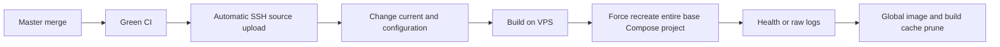
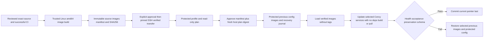

# Isolated Convy release and rollback

This is the historical exceptional plan/apply procedure underlying [automatic staging CD](staging-cd.md). Hetzner is shared staging; production does not exist. Ordinary compatible releases after first activation are automatic; the steps below are exceptional operator tools, not a per-release approval requirement. This procedure is source prepared for review. Installing tools, transferring artifacts, creating a staging backup/profile, merging, changing staging configuration, or applying a release requires separate operator approval. PR #33 completed the control transition. The old workflow is disabled. The transition below records the historical ordering; new CD remains inactive pending first activation.

## Previous and new flows





The application rollout targets only `api`, `worker`, `dashboard`, `auth`, and `mcp` present in the manifest and different from the current effective state. Existing PostgreSQL, Caddy, shared networks, certificate mounts and other products are prerequisites. An initial rollout means initially absent Convy applications on a pre-provisioned host; it does not provision shared infrastructure or migrate an empty database.

## Control master before any merge

1. Obtain explicit approval to disable the installed `Backend Staging Release` workflow and cancel its queued/in-progress runs. This is a GitHub control-plane change. Do not execute it under source-only authorization.
2. Disable it through Actions API/UI. Inspect all its runs, cancel pending/running deployment runs and confirm none remain. If a run already touched the host, reconcile live state read-only before continuing.
3. With separate merge approval and green exact-head CI, merge the control/prerequisite PR first. Its only release job prints an explanation, with no CI-completion trigger, SSH, credentials or deployment environment. Previously reviewed dependency/CI prerequisites allow this master-based PR to pass full CI without introducing Luna.
4. Read the installed master workflow and verify removal of every staging step. Leave it disabled. This was the transitional control boundary. After approved activation, compatible successful exact master CI authorizes the constrained automatic staging path.
5. Review/approve the Luna source and this release implementation. If Luna is merged separately first, reconcile this implementation branch against the new master, review the remaining diff and rerun CI on the resulting head before its approved merge.
6. Build from the exact final reviewed source SHA with successful latest CI. A merge/squash creates a new SHA: rebuild and review its new manifest. A branch artifact is not silently promoted to that new SHA.

`release-artifact.yml` is manual, read-only build/upload automation without staging secrets, environment or SSH. It checks latest successful exact-head CI. It never transfers, loads or deploys. No staging Actions workflow needs to be enabled. Future automation/protection changes require their own review and approval.

## Trusted artifact build

Python 3.12+, Git and a local Linux Docker daemon are required. All build contexts come from `git archive` of a full commit SHA, never the working tree. Source files and migration catalogs must be byte identical to the deployed schema baseline where required. Unrelated uncommitted files and secrets are excluded.

```bash
python3 ops/vps/build-release.py --repo /trusted/convy \
  --source REVIEWED_FULL_SHA --baseline DEPLOYED_SCHEMA_FULL_SHA \
  --output /protected/releases/REVIEWED_FULL_SHA
```

Use `--services api worker` only when source review establishes that those are the only affected images. Luna's accompanying frontend dependency changes require frontend images as well. The output contains `source.tar`, `images.tar`, `release.json`, and `release.sha256`. The manifest records full source/baseline SHA, platform, migration files digest/IDs, base Compose digest, service image IDs, portable image config IDs, and archive SHA256. Images are saved by ID without mutable repository tags. The output path cannot already exist. Preserve the approved artifact and prior artifacts; automatic CD retains current/designated rollback journals and implements targeted maintenance under the shared lease; see the new retention policy.

Docker Desktop's containerd store can identify an image by an OCI manifest/index digest; the classic Docker store identifies its config digest. The verifier checks the archive graph/config bytes and records both identities, validates platform and source labels, and permits resolution to the corresponding host-native ID after load. It never substitutes a mutable tag.

The current Dockerfiles contain version tags, not immutable base digests. This procedure guarantees delivery/recovery of the reviewed **artifact bytes**, not bit-identical future rebuilds against a changing registry. Rebuilds require fresh manifest/image/dependency review. Before a real release, apply the repository's image vulnerability review policy to those actual images.

## Pinned transfer and tool installation

Review/install the exact release-tool source from its immutable Git archive in a protected directory outside `current`, for example `/opt/convy/release-tools/TOOL_FULL_SHA`. Preserve LF bytes; never repair a transferred source tree in place. Verify hashes of the tool files and use that fixed path for deployment and recovery, even after `current` points to an older application source.

```bash
python3 ops/vps/transfer-release.py --bundle /protected/releases/SOURCE_SHA \
  --manifest MANIFEST_SHA256 --host root@APPROVED_HOST \
  --key /protected/deploy-key --known-hosts /protected/known_hosts \
  --pin APPROVED_KNOWN_HOSTS_FILE_SHA256 --remote-root /opt/convy/artifacts
```

Transfer is separately approved. The helper uses strict existing ed25519 trust, never key scanning/TOFU or pin updates. It verifies locally, creates a private uniquely named incoming directory, transfers only archives/manifest and verification code, verifies remotely, then publishes to a new immutable path. It cannot load images or start services. Failure retains a partial incoming directory for investigation; it does not replace an existing artifact or invoke global cleanup.

## Protected host profile and dry run

A root-owned 0600 profile specifies the actual ordered Compose files and ordered interpolation env files from the existing Caddy's Compose labels, plus all current shared overrides. Never guess a base-only invocation. Host-specific paths/topology belong in private infrastructure/operator material, not Convy source.

Required JSON fields:

| Field | Contract |
| --- | --- |
| `format`, `project` | `1`, existing `convy` Compose project |
| `composeFiles`, `composeHashes` | Exact ordered absolute base/override paths and every reviewed SHA256 |
| `envFiles` | Exact ordered root-owned 0600 interpolation files, including managed `/opt/convy/shared/release.env` and other private override inputs |
| `modelEnv` | Existing Convy `api.env`, within the application's current parent |
| `preserveFiles` | Existing shared Caddy configuration/fragments and protected Firebase/certificate files to hash, without reading values into logs |
| `current`, `stateRoot` | `/opt/convy/current`, private sibling such as `/opt/convy/release-state` |
| `schemaBaselineSha`, `migrationSha256`, `composeSha256` | Reviewed deployed source/catalog/base Compose identities |
| `backupFile`, `backupSha256`, `restoreProofFile` | Fresh custom PostgreSQL dump and protected independent restore proof |
| `healthTimeoutSeconds`, `minimumFreeBytes` | 1–600 seconds; default 120; free disk floor default 8 GiB plus twice incoming image size and 336 MiB for static recovery |
| `acceptance` | Bounded command arrays for actual API/auth/MCP/dashboard/shared routes and authorization behavior; zero paid-provider calls by default |

The restore proof is root-owned 0600 JSON containing `backupSha256`, `isolatedRestoreSucceeded: true`, and UTC `verifiedAtUtc`. Both backup mtime and restore verification must be less than one hour old. A proof is an operator-reviewed record of an actual isolated restoration, not a substitute for executing restoration. The controller independently verifies the dump SHA and `pg_restore --list`, streaming the dump without loading it into host memory. It never restores a staging database.

Before constructing the profile, capture current read-only capacity/health/IDs/protected-state evidence and create/verify a fresh supported Convy backup under separate live authorization. Confirm sufficient RAM, disk and inode headroom and preserve/off-host copy recovery material. Preserve the actual Caddy mounts/certificates and existing overrides. Do not restore historical whole-host config archives that predate shared routing.

```bash
python3 /opt/convy/release-tools/TOOL_SHA/safe-release.py plan \
  --profile /protected/convy-release-profile.json \
  --bundle /opt/convy/artifacts/SOURCE_SHA-MANIFEST_PREFIX --manifest MANIFEST_SHA256
```

Plan verifies private artifacts, complete checksums/provenance, unchanged schema/source Compose, actual PostgreSQL migration history, current services/env/mounts/networks, existing shared networks/volumes, complete effective Compose round-trip, fresh recovery evidence and capacity. It preserves literal `$` values across Compose serialization. It prints only reviewed non-secret changes, paths, service selection and hashes. No load, restart, config write or symlink change occurs. Wrong artifacts, stale/missing backup, missing/pending/unknown migration, invalid Compose or missing approval fail closed.

The approval digest binds the exact profile, manifest, source hashes, container identities/config fingerprints, effective before/after configuration, database history, recovery proof, current pointer and tool bytes. Reordering equivalent Docker mount/alias metadata is normalized. Any meaningful change requires a new plan and review. An already-applied artifact is a no-op and needs no new backup.

## Apply and independent rollback

Only after explicit approval of the concrete plan:

```bash
python3 /opt/convy/release-tools/TOOL_SHA/safe-release.py apply \
  --profile /protected/convy-release-profile.json \
  --bundle /opt/convy/artifacts/SOURCE_SHA-MANIFEST_PREFIX \
  --manifest MANIFEST_SHA256 --approve APPROVED_PLAN_SHA256
```

The controller rechecks under an exclusive lock. Before loading it saves the exact previous effective config/env/current/IDs, a separate migration-disabled rollback config, previous image archive and checksum-bound recovery metadata, then extracts verified immutable source. Private snapshots are 0600 under 0700; no secrets enter ordinary logs. It verifies the artifact again before load and uses only existing external networks/volumes. Each changed service runs `up -d --no-deps --no-build --pull never SERVICE`; there is no project-wide up, force recreation, orphan removal, down or prune.

Health checks and configured acceptance must pass. Every unrelated container fingerprint and preserved file hash must remain unchanged; database migration history must remain unchanged. `current` changes only after acceptance. A journal survives interruption. Transfer/preflight/preparation failure leaves applications unchanged; load/start/health/acceptance failure triggers scoped automatic recovery. New image caches remain available without retagging current images.

For a later manual rollback or interrupted transaction:

```bash
python3 /opt/convy/release-tools/TOOL_SHA/safe-release.py rollback-plan \
  --profile /protected/convy-release-profile.json --state /opt/convy/release-state/STATE_DIRECTORY
python3 /opt/convy/release-tools/TOOL_SHA/safe-release.py rollback \
  --profile /protected/convy-release-profile.json --state /opt/convy/release-state/STATE_DIRECTORY \
  --approve APPROVED_ROLLBACK_PLAN_SHA256
```

Recovery verifies snapshot/archive digests and unchanged schema/shared state, reloads missing previous images from its retained archive, restores exact protected env bytes/metadata and only affected previous services, and restores the previous pointer/active record. Initially absent app containers are removed individually after ownership verification. Caddy, PostgreSQL, other products, networks, certificates and static shared content are never recreated or restored. `RECOVERY_REQUIRED` means automatic recovery itself failed; use the retained state and explicit manual recovery approval, not a whole-project deploy/restore.

## Migration and Luna configuration policy

This controller supports **no schema changes**. The complete migration source catalog (including designer/model snapshot) must match the deployed baseline, and every applied migration ID must exactly match the candidate. New, pending, unknown, incompatible or nonreversible migrations require a separately reviewed deployment/data recovery procedure. No staging migration or staging database restore is invoked here.

The current API can have `Database__MigrateOnStartup=true`. Candidate and rollback API configurations explicitly override it to `false`; the protected original setting is retained in the original snapshot/environment. Worker source has no migration-on-startup path. Database history is rechecked during apply and recovery. Old images can therefore be recovered without performing startup migrations.

Only these protected model/pricing keys change: `OpenAI__ParsingModel=gpt-6-luna`, parsing input/cached/cache-write/output microdollars per 1K tokens `100/10/125/500`. Remove only legacy `OpenAI__Costs__ParsingReasoningMicrosPer1KTokens`. Every other env line/value, API key and secret stays intact. Preserve `gpt-4o-mini-transcribe` and the existing transcription-price decision, including unknown price when empty. Do not call the broad secret-push script to update Luna. Reasoning `none` and single output billing are reviewed application behavior, not invented env settings. Requests/strict schema and accounting are covered by backend tests; fixtures do not claim real-provider language accuracy.

## Validation and remaining live approval

Run `python -m unittest discover -s ops/vps/tests -p test_release.py -v`, `python ops/vps/tests/validate_release_docker.py`, all backend tests and relevant infrastructure checks. GitHub's `Isolated Release & Rollback` job exercises real Linux/Docker state transitions; fault shims fail individual commands while all other Docker operations are real. Shared Caddy/PostgreSQL are real containers; the Convy/Converso HTTP applications are provider-free fixtures. Fixture cleanup is confined to its generated local project and is not release code.

Source readiness requires green final-head CI and recorded preservation. It is not live readiness or permission to merge. Subsequent approval must cover workflow disable/cancellation, ordered reviewed merges, exact merged SHA/artifact/CI, tool installation/transfer, current profile/backup/isolated restoration/capacity, concrete dry-run digest, only reviewed env changes, scoped activation/recovery and post-release acceptance/soak. Real Luna/provider acceptance and any paid requests require the intended explicit authorization. Recurring backups/notifications, whole-host recovery, credential rotation, other products and staging automation remain separately scoped.
